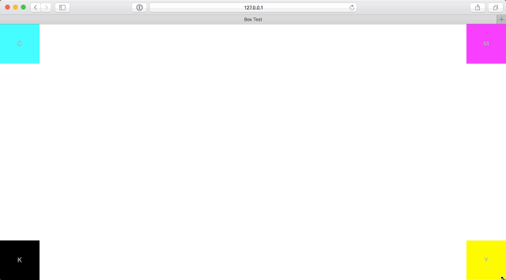
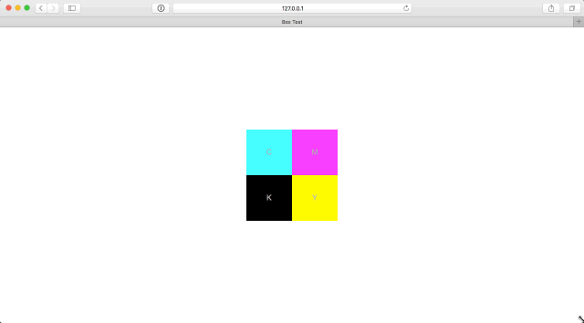
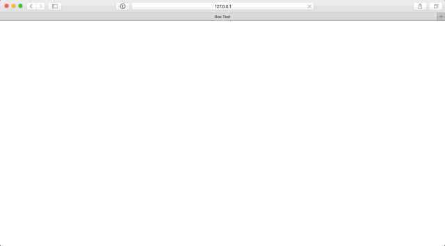
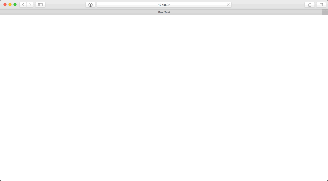

# Box Test Challenge

## Solution

* Run it using: `npm run server`
* I only used HTML and CSS
* The speed of the animations was not specified so I used 1s
* Tested on Chrome, Firefox and Safari
* To respect the timing between `15` to `45` minutes, I was not able to test in IE

## Description

Write some HTML, CSS, and JavaScript to complete the following steps.

* Use `index.html` to write your HTML (loads `bundle.css` and `bundle.js`)
* Use `boxtest.scss` to write your CSS (compiles to `bundle.css`)
* Use `boxtest.js` to write your JavaScript (compiles to `bundle.js`)

#### Step 1



* Create 4 boxes in the DOM
* Each box should be `100px` wide and `100px` tall
* Each box will contain a single letter in counter-clockwise order:
    * `C`: top left
    * `M`: top right
    * `Y`: bottom right
    * `K`: bottom left
* Each box will have a background color:
    * `C`: cyan
    * `M`: magenta
    * `Y`: yellow
    * `K`: black
* The text for each box should be styles with:
    * size: `16px`
    * color: `#acacac`
    * font: `Helvetica`
* The text for each box should be horizontally and vertically aligned in the center
* Each box should stick to its respective corners when resizing the browser window (see **Step 1** gif)
* No JavaScript is allowed

#### Step 2



Place all boxes in the center of the browser window building upon what you did in **Step 1**.

* Do not modify the CSS that was written for **Step 1** (you'll see why in **Step 3**)
* Center all 4 boxes in the center of the browser window
* All 4 boxes should stay centered in the browser window when resizing the browser window (see **Step 2** gif)
* No JavaScript is allowed

#### Step 3



Apply timed animation effects building upon what you did in **Step 1** and **Step 2**. Each animation effect should follow this order:

> For all steps wait until the previous animation has completed before continuing to the next animation.

1. All boxes should be hidden on page load
2. Fade in each box one at a time in clockwise order
    1. Fade in box `C`
    2. Fade in box `M`
    3. Fade in box `Y`
    4. Fade in box `K`
3. Transition the position of each box in counter-clockwise to the center of the browser window
    1. Transition box `K`
    2. Transition box `Y`
    3. Transition box `M`
    4. Transition box `C`
4. Fade out each box one at a time in clockwise order
    1. Fade out box `C`
    2. Fade out box `M`
    3. Fade out box `Y`
    4. Fade out box `K`

> The animations do not need to repeat once the boxes have faded out.

### Challenge Requirements
* No other libraries may be used outside of `jQuery`
* Use of ES6 and ES7 syntax is preferred, but you can use ES5 syntax if that's your thing
* You should be able to resize the browser window at all times without breaking any of the above steps (see **Step 3 resize** gif below)



#### Bonus Points
* Don't use `jQuery`
* Complete steps 1-3 using only CSS. It's definitely possible!
* Inline documentation

## Setup

#### Requirements

* A recent version of Node.js `>= 4.0`
* A recent version of NPM `>= 2.14`
* Chrome, Firefox, Safari, or Microsoft Edge

#### Install

```shell
npm install
```

#### Start Development

* Start a local livereload server
* Compile ES7 and ES6 JavaScript to ES5 compatible file: `bundle.js`
* Compile SCSS to CSS file: `bundle.css`

```shell
npm run start
```


## Challenge Duration

This challenge should take anywhere between `15` to `45` minutes.

## Difficulty Level

Jr to Mid Level
